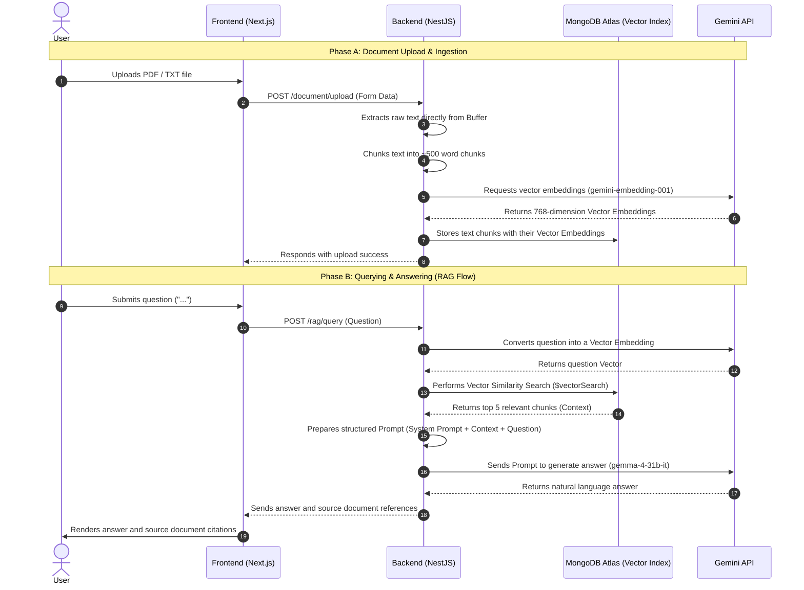

# 🧠 AI RAG (Retrieval-Augmented Generation) System

An advanced **Retrieval-Augmented Generation (RAG)** system that allows users to upload documents (PDF, TXT), automatically extracts text, performs sliding window chunking, generates Vector Embeddings to store in a MongoDB Atlas vector database, and handles user questions by retrieving relevant context and generating natural responses using Google Gemini LLMs.

---

## 🚀 Key Features

*   **Document Ingestion Flow**: Supports drag-and-drop or file selection for `.pdf` and `.txt` files. Processes extraction directly in memory (Memory Buffer Parsing) without saving temporary files to the disk.
*   **Smart Sliding Window Chunking**: Splits documents into smaller chunks (~500 words with 100-word overlap) to preserve seamless text context.
*   **High-Performance Vector Search**: Uses the `gemini-embedding-001` model to convert text chunks into 768-dimensional vector representations and performs cosine similarity search using **MongoDB Atlas Vector Search**.
*   **Anti-Hallucination Guardrails**: Implements strict Prompt Engineering constraints to ensure the LLM only answers questions based on the retrieved context. If information is missing, the AI returns a safe, pre-defined response.
*   **Interactive Chat UI**: Provides a clean, real-time chat interface showing the AI responses along with referenced source document citations.

---

## 🛠️ Tech Stack

### 🔹 Backend (Node.js & NestJS)
*   **Framework**: [NestJS](https://nestjs.com/) (Modular architecture, TypeScript)
*   **Database**: MongoDB (using `@nestjs/mongoose` with **Atlas Vector Search**)
*   **AI SDK**:
    *   `@google/generative-ai` - Direct integration with Google AI Studio API.
    *   `@langchain/google-genai` & `@langchain/core` - Flow orchestration and embeddings via LangChain.
*   **File Processing**:
    *   `Multer` - Handles multi-part/form-data uploads directly to buffer.
    *   `pdf-parse` - Extracts text content from PDF file buffers.

### 🔹 Frontend (Next.js)
*   **Framework**: [Next.js](https://nextjs.org/) (App Router, React 19, TypeScript)
*   **Styling**: Tailwind CSS (v4.x) & Lucide React (Icons)
*   **HTTP Client**: Axios

### 🔹 AI Models
1.  **Embedding Model**: `gemini-embedding-001` (Converts document chunks into vectors).
2.  **LLM Chat Model**: `gemma-4-31b-it` (Generates natural answers from contextual data).

---

## 📁 Directory Structure

```text
rag-system/
├── backend/                  # NestJS API Server
│   ├── src/
│   │   ├── document/         # Document handling (Schema, Service, Controller, Parser)
│   │   ├── embedding/        # Vector embedding generation via Gemini API
│   │   ├── rag/              # RAG flow orchestration and LLM chat calls
│   │   ├── app.module.ts     # Root Module
│   │   └── main.ts           # Entry point (CORS, Port 5000, etc.)
│   ├── .env                  # Backend environment configuration
│   └── package.json
├── frontend/                 # Next.js UI Client
│   ├── app/                  # Pages & Layouts (React Server Components, Global CSS v4)
│   ├── components/           # UI Components (ChatWindow, DocumentUploader)
│   └── package.json
└── README.md                 # This file
```

---

## ⚙️ Setup & Running Guide

### 1. Prerequisites
*   **Node.js**: Latest LTS version (v18+ recommended).
*   **MongoDB Atlas**: A free or paid MongoDB Atlas cluster.
*   **Google Gemini API Key**: Get your API Key from [Google AI Studio](https://aistudio.google.com/).

### 2. MongoDB Atlas Vector Search Index Setup
For the vector similarity search to work, you must define a **Vector Search Index** on your MongoDB Atlas cluster:
1.  Navigate to your cluster on the Atlas Dashboard.
2.  Select **Search** -> **Create Search Index** -> Choose **JSON Editor**.
3.  Select the database and collection where your documents are stored (usually `documents`).
4.  Configure the index mapping (name it `vector_index`):
    ```json
    {
      "fields": [
        {
          "numDimensions": 768,
          "path": "chunks.embedding",
          "similarity": "cosine",
          "type": "vector"
        }
      ]
    }
    ```
5.  Click **Create Search Index** and wait for the status to change to **Active**.

### 3. Backend Setup & Configuration
1.  Navigate to the `backend/` directory:
    ```bash
    cd backend
    ```
2.  Copy the environment template file:
    ```bash
    cp .env_example .env
    ```
3.  Update the connection parameters in `.env`:
    ```env
    MONGODB_URI=mongodb+srv://<username>:<password>@cluster.mongodb.net/<database_name>?retryWrites=true&w=majority
    GEMINI_API_KEY=your_gemini_api_key_here
    PORT=5000
    ```
4.  Install dependencies:
    ```bash
    npm install
    ```
5.  Start the Backend development server:
    ```bash
    npm run start:dev
    ```
    *API Server will run at [http://localhost:5000](http://localhost:5000)*

### 4. Frontend Setup & Configuration
1.  Open a new terminal window and navigate to the `frontend/` directory:
    ```bash
    cd frontend
    ```
2.  Install dependencies:
    ```bash
    npm install
    ```
3.  Start the Frontend development server:
    ```bash
    npm run dev
    ```
    *Client application will run at [http://localhost:3000](http://localhost:3000)*

---

## 🔄 System Workflow



---
